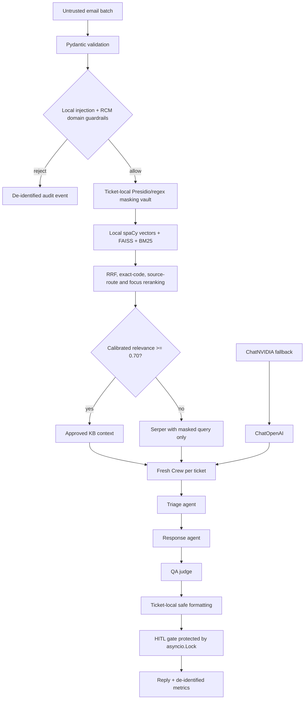

# Secure CrewAI Medical Billing / RCM Support

[](https://github.com/mohan91official-Creation/medical-rcm-support/actions/workflows/ci.yml)

An enterprise-oriented reference project for processing US medical-billing support emails with CrewAI,
LangChain, Pydantic v2, local hybrid retrieval, optional Serper search, LangSmith observability, and Google
Sheets lifecycle metrics.

**Buildathon shortcuts:** [5-minute demo guide](DEMO_GUIDE.md) · [Security policy](SECURITY.md) ·
[Automated quality gate](https://github.com/mohan91official-Creation/medical-rcm-support/actions/workflows/ci.yml)

The optional `gmail_workflow.py` adapter supports a consent-driven live test using a dedicated Gmail
inbox. It processes only unread messages with a configured subject prefix, blocks automated senders,
requires application HITL approval plus a separate send confirmation, preserves the Gmail thread, and
labels successfully handled messages.

Audit sinks never store the customer email address. When `AUDIT_PSEUDONYM_KEY` is configured, they store
a stable keyed HMAC contact reference and an opaque Gmail message ID so authorized operators can
correlate events without exposing the address in Sheets.

> **Important:** This project demonstrates engineering controls; it does not make a deployment HIPAA
> compliant and is not legal, medical, coding, or reimbursement advice. A covered entity or business
> associate still needs contracts/BAAs, a documented risk analysis, policies, workforce training,
> appropriate infrastructure, and counsel/compliance approval.

## Architecture assessment

The requested design is a strong proof-of-concept, but a true enterprise RCM platform needs more than an
agent script. The top recommendations are:

1. **Durable orchestration and idempotency.** Put accepted tickets on a durable queue (for example,
   SQS/RabbitMQ/Kafka plus Temporal or Celery), assign idempotency keys, and use a dead-letter queue.
   `asyncio.gather` is appropriate for this single-process reference, not crash recovery.
2. **Policy enforcement outside the LLM.** Keep deterministic authorization, recipient verification,
   tenant isolation, prompt-injection checks, DLP, and release approval outside agent reasoning. This
   project implements that lightweight boundary and a serialized HITL console gate.
3. **HIPAA-grade key and audit infrastructure.** Use a BAA-eligible deployment, KMS/HSM-backed secrets,
   encrypted databases, immutable audit storage, retention/deletion rules, RBAC/ABAC, private networking,
   egress allowlists, and incident response. Never treat `.env`, JSONL, or a general Sheet as the system
   of record.
4. **Authoritative healthcare knowledge governance.** Version CMS/NCCI/payer policies with effective
   dates, jurisdiction, line of business, provenance, clinical/coding review, and a release workflow.
   Add X12 270/271, 276/277, 835, and 837 validation where applicable. A generic web result must never
   override an authoritative payer or regulatory source.
5. **Continuous evaluation and operations.** Maintain PHI-leakage, injection, hallucination, retrieval,
   coding-safety, latency, fallback, and human-agreement test sets. Add rate limiting (often Redis),
   circuit breakers, budgets, SLOs, alerting, canary releases, and model/prompt version tracking.

Lightweight controls from items 1, 2, 4, and 5 are included: unique ticket IDs, validation, isolated crews,
bounded concurrency, deterministic privacy/guardrail gates, source confidence routing, Pydantic contracts,
QA judging, human approval, usage/cost fields, and per-ticket exception isolation.

## System flow



Only masked subject, sender, content, and query text cross into the crew, providers, optional web search,
or traces. The raw-to-token mapping remains in a ticket-local in-memory object and is never audited.

## What is implemented

- Strict Pydantic v2 input, intermediate, QA, usage, and final-result models.
- Local prompt-injection and RCM-domain rejection before any external call.
- Presidio masking when available, with healthcare-oriented regex fallback.
- Ticket-local masking maps; unknown model-created mask tokens fail closed.
- Local `en_core_web_lg` semantic vectors indexed by FAISS, exact Okapi BM25, reciprocal-rank fusion,
  CARC/RARC exact-code matching, intent-aware source routing, decisive-term reranking, and Serper only
  below `RAG_THRESHOLD` (default `0.70`). Retrieval text stays local.
- Portable exact NumPy inner-product fallback when endpoint security blocks the native FAISS library;
  the same normalized vectors and reranking pipeline remain in use.
- Boilerplate, bibliography, and revision-history chunks are excluded from LCD coverage answers; the
  original scope notice and PDF page provenance remain in the selected model context.
- A new sequential Crew, agents, tasks, LLM adapter, and usage ledger for every ticket.
- `verbose=True` triage, response, and QA agents with delegation and memory disabled.
- LangChain `ChatOpenAI.with_fallbacks([ChatNVIDIA])`, adapted through CrewAI `BaseLLM`.
- Pydantic `output_pydantic` on every CrewAI task and a final LLM-as-a-judge QA contract.
- Optional person-name re-identification only after QA, only from the same ticket vault. Other identifiers
  are minimized to neutral phrases; re-identification defaults off.
- `asyncio.gather(..., return_exceptions=True)`, a concurrency semaphore, per-ticket failure results,
  elapsed timing, and an `asyncio.Lock` around interactive human approval.
- LangSmith tracing disabled by default and enabled only when both toggle and key are set. The legacy
  `LANGCHAIN_TRACING_V2` toggle mirrors the current `LANGSMITH_TRACING` value.
- Google Sheets service-account logging or local JSONL mock logging. Rows contain IDs, status, retrieval
  metadata, tokens, estimated cost, timing, and error class—never email text or the PHI map.
- Knowledge-base auto-bootstrap plus an included sample and two demo tickets.

## Project files

```text
.
├── app.py
├── requirements.txt
├── requirements-dev.txt
├── .env.example
├── .gitignore
├── README.md
├── evaluate_retrieval.py
├── pyproject.toml
├── pyrefly.toml
├── tests/
│   ├── test_security.py
│   └── test_retrieval.py
├── .github/workflows/ci.yml
├── evaluation/
│   ├── retrieval_cases.json
│   └── retrieval_report.json
└── knowledge_base/
    ├── sample_policy.txt
    ├── sources_manifest.json
    └── sources/
        ├── Claim Adjustment Reason Codes.md
        ├── Remittance Advice Remarks Codes.md
        └── LCD - Cardiac Computed Tomography ... (L33947).pdf
```

## Run locally

Python 3.11 through 3.13 is supported by this reference; this walkthrough uses Python 3.13.

```bash
python -m venv .venv
```

Activate it on macOS/Linux:

```bash
source .venv/bin/activate
```

Or Windows PowerShell:

```powershell
.venv\Scripts\Activate.ps1
```

Install and configure:

```bash
python -m pip install --upgrade pip
pip install -r requirements.txt
python -m spacy download en_core_web_lg
cp .env.example .env
```

On Windows, use `Copy-Item .env.example .env` instead of `cp`. Fill in `OPENAI_API_KEY`. Add
`NVIDIA_API_KEY` to activate provider fallback and `SERPER_API_KEY` to activate low-confidence web
fallback. Then run:

```bash
python app.py
```

Before making paid model calls, run the offline golden-set evaluation:

```bash
python evaluate_retrieval.py --tune
```

It makes no LLM, OpenAI, NVIDIA, Serper, or LangSmith calls. It reports Hit@3, reciprocal rank,
Precision@3, forbidden-source contamination, threshold pass rate, and the best tested weight preset.
The command exits unsuccessfully if a required source is missed, a forbidden source leaks into the top
results, or the top score fails the configured threshold. Add reviewed cases to
`evaluation/retrieval_cases.json` whenever the knowledge base or supported workflow changes.

## Automated quality gate

Install the developer-only tools and run the same checks used by GitHub Actions:

```bash
python -m pip install -r requirements-dev.txt
python -m py_compile app.py evaluate_retrieval.py
python -m ruff check .
python -m pytest -q
python evaluate_retrieval.py --tune
```

The tests exercise prompt-injection rejection, out-of-domain rejection, RCM acceptance, ticket-local PHI
masking, fail-closed privacy tokens, safe reply formatting, allowlisted audit logging, exact CARC/RARC
routing, and LCD page prioritization. They are fully offline and require no provider keys. The CI workflow
uses read-only repository permissions, disables tracing and CrewAI telemetry, and never receives `.env` or
service-account credentials. GitHub recommends `setup-python` for consistent Python workflows; this project
uses the current `actions/checkout@v7` and `actions/setup-python@v7` releases.

The out-of-domain/injection demo ticket is rejected without an LLM call. Accepted tickets require an
OpenAI key. With `AUTO_APPROVE=true`, QA approves only scores of at least `0.80`; set it to `false` for an
interactive release prompt. Replace `DEMO_EMAILS` with your validated intake adapter in production.

Presidio may require a spaCy English model. If Presidio cannot initialize, the app logs that it is using
regex masking. That fallback is intentionally runnable but is not sufficient as an enterprise DLP layer.

## Configuration notes

- Keep `.env` and service-account JSON outside source control; `.gitignore` excludes both.
- Set pricing variables from your current provider agreement. Defaults are zero so the sample does not
  silently present stale prices as accurate costs.
- A Google service account must have access to the target Sheet. Set `GOOGLE_SHEET_ID` and
  `GOOGLE_SERVICE_ACCOUNT_FILE`; otherwise events go to `runtime/ticket_events.jsonl`.
- `REIDENTIFY_PERSON_NAMES=false` is the safer email default. If enabled, the app can restore only person
  tokens found in that same ticket. IDs, dates, phones, and addresses remain generalized.
- Do not place PHI in the knowledge-base sample. Production source documents need classification,
  access control, provenance, review, and retention policies.
- The bundled CARC and RARC Markdown files are secondary snapshots dated 2024-11-22 and point to X12 as
  the canonical authority. Verify current X12 content before production decisions. The bundled CMS LCD
  L33947 is version 25, effective 2025-10-09, and applies only to CGS J15 (Kentucky and Ohio); its billing
  codes are maintained separately in article A56451. The retriever injects these scope notices into every
  affected chunk and preserves PDF page provenance.
- The reference intentionally uses local spaCy word vectors so RAG queries do not require another external
  data transfer. BM25 and exact-code features handle terminology that static vectors represent poorly.
  A deterministic hash fallback keeps the sample runnable if the large spaCy model is unavailable, but
  the offline evaluation must pass before release.

## Security model and limitations

The LLM is not a security boundary. Inputs are rejected or masked before model construction; agents receive
explicit untrusted-data instructions; web queries are masked; model output is checked against the ticket's
known token set; and logging is allowlist-based. Exceptions log only ticket ID and exception class in the
result, although local stack traces can contain framework internals. Configure production exception sinks
with redaction and access controls.

Regex and general NER can miss PHI, especially free text, OCR errors, uncommon identifiers, addresses, and
contextual quasi-identifiers. Before real data, add adversarial DLP tests and an approved PHI detection
service, validate provider BAAs and data controls, disable provider retention where contractually available,
and conduct a formal HIPAA security/privacy review.

Serper content is untrusted and can contain prompt injection or inaccurate guidance. It is supplied as data,
not instructions, and QA is told not to add unsupported facts; production should additionally use an
allowlisted domain retriever, content sanitizer, signed snapshots, and source/rule precedence.

## Verification basis

The implementation follows current documented interfaces checked on 2026-08-19:

- CrewAI documents custom providers through `BaseLLM.call(...)` and `output_pydantic` task outputs:
  [custom LLM](https://docs.crewai.com/en/learn/custom-llm),
  [tasks](https://docs.crewai.com/en/concepts/tasks).
- LangChain documents `ChatNVIDIA` in `langchain-nvidia-ai-endpoints`, including native async and token
  usage support: [ChatNVIDIA integration](https://docs.langchain.com/oss/python/integrations/chat/nvidia_ai_endpoints).
- LangSmith's current environment names are `LANGSMITH_TRACING`, `LANGSMITH_API_KEY`,
  `LANGSMITH_ENDPOINT`, and `LANGSMITH_PROJECT`: [tracing configuration](https://docs.langchain.com/langsmith/trace-without-env-vars).
- OpenAI lists `gpt-4o-mini` as an API model with structured outputs:
  [official OpenAI model page](https://developers.openai.com/api/docs/models/gpt-4o-mini).
- gspread documents service-account use, `open_by_key`, and row appends:
  [gspread user guide](https://docs.gspread.org/en/v6.2.1/user-guide.html),
  [worksheet API](https://docs.gspread.org/en/v6.2.1/api/models/worksheet.html).
- FAISS documents `IndexFlatIP` exact inner-product search, used here on L2-normalized local vectors:
  [FAISS IndexFlatIP](https://faiss.ai/cpp_api/struct/structfaiss_1_1IndexFlatIP.html).
- spaCy documents that `Doc.vector` is a real-valued representation averaging token vectors, and that
  large (`lg`) pipelines include static vectors:
  [spaCy Doc vectors](https://spacy.io/api/doc), [spaCy vector guidance](https://spacy.io/usage/spacy-101).

Dependencies use compatible ranges for readability. Production should resolve them in CI, run integration
tests, security scanning, and generate a hash-locked file (for example with `uv lock` or `pip-compile`).

## Production upgrade roadmap

**Phase 1 — safety validation**

- Add unit/property tests for overlapping PHI, every RCM category, malicious prompt corpora, unknown tokens,
  malformed batches, and log redaction.
- Build a versioned golden evaluation set and LangSmith evaluators for leakage, retrieval grounding, RCM
  correctness, response usefulness, and human agreement.
- Replace console HITL with an authenticated review queue and two-person approval for high-risk cases.

**Phase 2 — resilient platform**

- Split intake, DLP, retrieval, orchestration, review, delivery, and audit into independently authorized
  services. Add durable queues, idempotency, retry classes, dead-letter queues, Redis rate limits/caching,
  circuit breakers, and tenant quotas.
- Use encrypted transactional storage and immutable audit records with KMS-managed keys, retention policies,
  backups, disaster recovery, and tested restore procedures.
- Add OpenTelemetry metrics, traces with allowlisted attributes, SLOs, paging, and per-provider budgets.

**Phase 3 — healthcare governance**

- Ingest versioned CMS, MAC, Medicaid, commercial-payer, and contractual policies with effective dates and
  provenance. Add terminology/code-set licensing and qualified coding review.
- Add X12-aware validators and workflow-specific deterministic rules. Keep all final code, coverage,
  medical-necessity, appeal, and payment decisions under authorized human/process controls.
- Complete vendor risk reviews, BAAs, threat modeling, penetration testing, access reviews, privacy impact
  assessments, and recurring HIPAA risk analysis.

## Publish to GitHub

Review the tree and confirm that `.env`, credentials, runtime logs, and real customer data are absent:

```bash
git status
git diff --check
git grep -n -I -E "(sk-[A-Za-z0-9]|nvapi-|BEGIN PRIVATE KEY|John Smith|ABC12345)" -- . ':!README.md' ':!app.py'
```

The last command intentionally finds demo identifiers in `app.py`; remove or replace demo data if your
organization's scanner disallows synthetic identifiers. Then:

```bash
git init
git add app.py requirements.txt .env.example .gitignore README.md knowledge_base/
git commit -m "Add secure CrewAI RCM support reference"
git branch -M main
git remote add origin https://github.com/YOUR_ORG/YOUR_REPO.git
git push -u origin main
```

For an existing repository, do not re-run `git init`; create a feature branch and open a pull request.
Enable secret scanning, dependency updates, protected branches, required reviews, signed releases, and CI
checks before accepting contributions.
